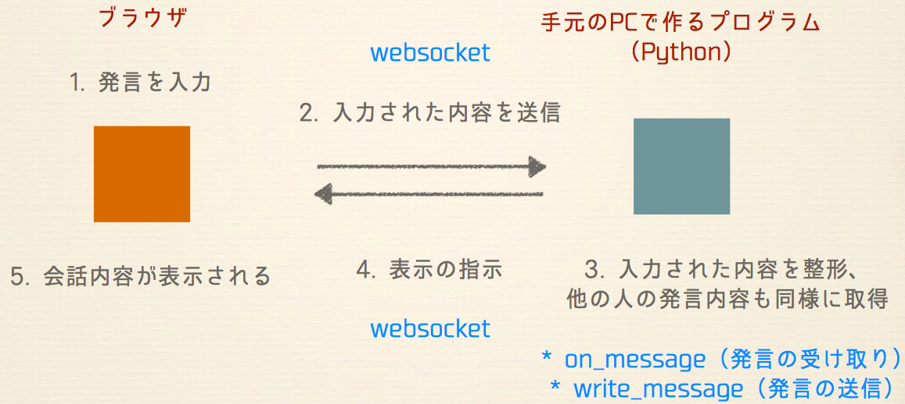

# Girls Tech Fes - PyLadies Tokyo Workshop
## チャットを作ってみよう！〜Pythonでたのしくプログラミング〜



## チャット機能作成手順
### 1. チャットページに遷移しよう

```python
    def post(self):
        logging.debug(u"xsrf_cookie:" + self.get_argument(u"_xsrf", None))

        self.check_xsrf_cookie()
        username = self.get_argument(u"username")
        logging.debug(u'サインアップメソッドで {0} の名前を受け取りました'.format(username))

        if username:
            self.set_secure_cookie(u"chatdemo_user", tornado.escape.utf8(username))
            self.redirect(u"/")
        else:
            self.set_status = 403
            self.set_header('Content-Type', 'text/html; charset="utf-8"')
            self.finish(
                '名前が入力されていません。最初からやり直して下さい。<br><a href=http://localhost:{port}>ログインページに戻る</a>'.format(port=options.port))
```

### 2. チャット機能を作ろう

```python
    # 1. Web Socketを繋げる
    def open(self):
        ChatSocketHandler.waiters.add(self)

    # 2. Web Socketを閉じる
    def on_close(self):
        ChatSocketHandler.waiters.remove(self)

    # 3. メッセージの整形
    def on_message(self, message):
        logging.info(u"got message %r", message)
        parsed = tornado.escape.json_decode(message)
        username = self.get_secure_cookie(u"chatdemo_user")

        chat = {
            u"id": unicode(uuid.uuid4()),
            u"from": unicode(username, encoding=u'utf-8'),
            u"body": parsed[u"body"],
            }
        chat[u"html"] = tornado.escape.to_basestring(
            self.render_string(u"message.html", message=chat))

        ChatSocketHandler.update_cache(chat)
        ChatSocketHandler.send_updates(chat)

    # 4. 会話履歴を保存する
    @classmethod
    def update_cache(cls, chat):
        cls.cache.append(chat)
        if len(cls.cache) > cls.cache_size:
            cls.cache = cls.cache[-cls.cache_size:]

    # 5. 打った文字列を表示させる
    @classmethod
    def send_updates(cls, chat):
        logging.info(u"sending message to %d waiters", len(cls.waiters))
        print chat
        for waiter in cls.waiters:
            try:
                waiter.write_message(chat)
            except:
                logging.error(u"Error sending message", exc_info=True)


```

### 3. サーバに繋いでみんなとチャットしよう

- `完成品サンプル`というショートカットを開いてみましょう
- ログインして他の参加者とチャットしてみましょう
